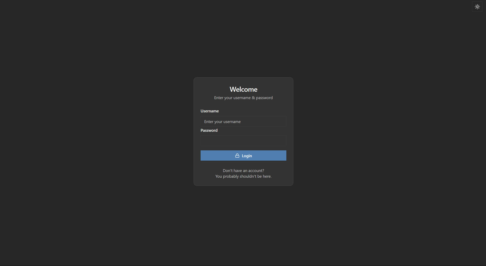
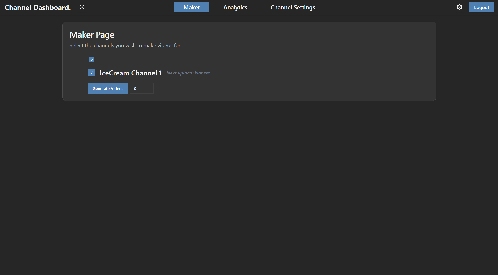
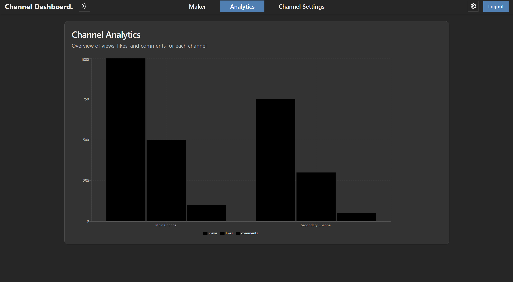
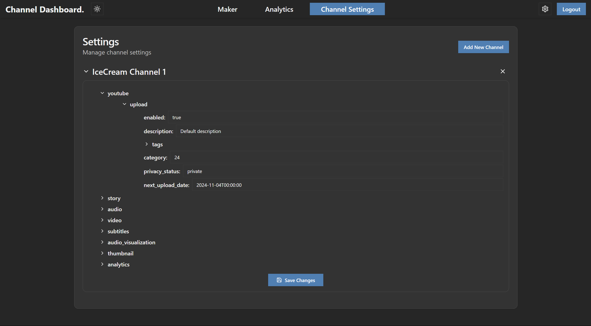
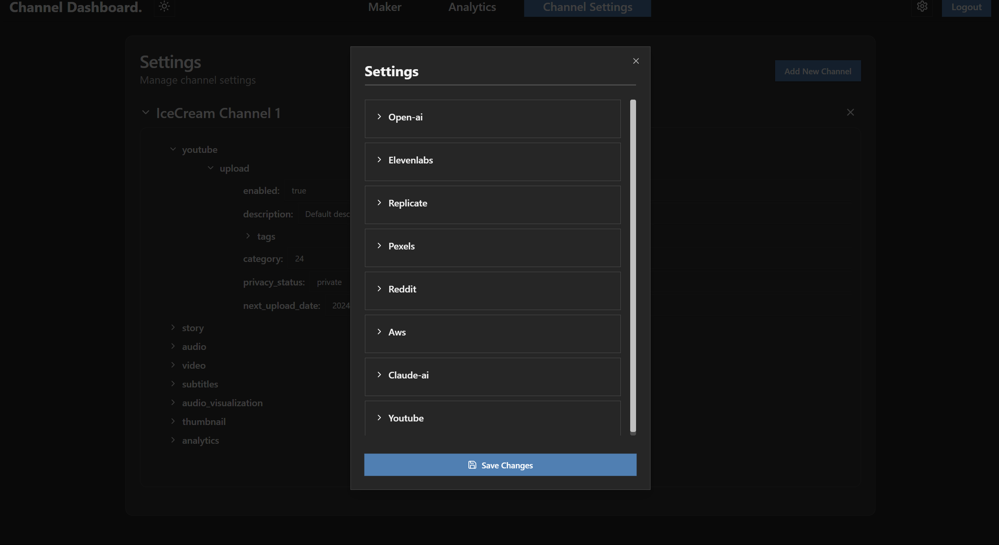

# Youtube Dashboard

Personal project to make a dashboard to manage my automated youtube channels for myself and others.

---

## Login

Only login and no sign up interface as I register accounts up before hand to login. Users and their ID's are stored in MongoDB prior. After successfully logging in a user id and JWT token is stored in the local cache for proper authentication and retrieving the correct information for each user.

---

## Video Creation

Allows you to select channels to generate a certain number of videos for. After clicking generate the backend will then assign an id to the task and then asychronously run a python file passing the arguments of channel names, user id. The python file then handles the rest of the video generation.

---

## Analytics Page

Unfinished page where in the future the analytics of specific or combined channels is shown. Currently the backend is not complete and not connected to the frontend.

---

## Channel Settings

Allows you to configure channel video settings such as story length, background type, background music, etc. The channel settings are stored in MongoDB as well as locallay to reduce traffic to server and improve website speed.

---

## Overall Settings

Place where you input your API keys/tokens needed in order for the program to function properly. Settings are stored and edited in MongoDB.

---

NOTE: This project is still in development and has much needed work.
